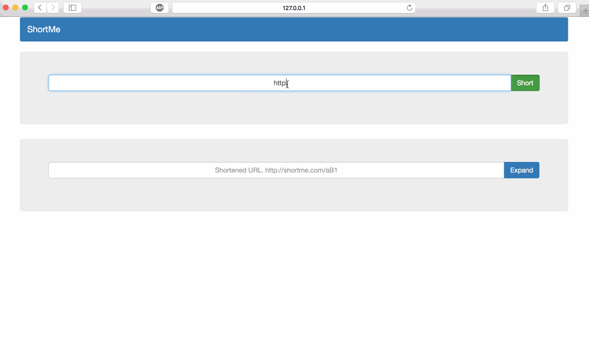

  


[](https://travis-ci.org/andyxning/shortme)
### Introduction
----
ShortMe is a url shortening service written in Golang.  
It is with high performance and scalable.  
ShortMe is ready to be used in production. Have fun with it. :)

### Features
----
* Convert same long urls to different short urls.
* Api support
* Web support
* Short url black list
    * To avoid some words, like `f**k` and `stupid`
    * To make sure that apis such as `/version` and `/health` will only be
    used as api not short urls or otherwise when requesting `http://127.0.0.1:3030/version`, version info will be returned rather the long url corresponding to the short url "version".
* Base string config in configuration file
    * **Once this base string is specified, it can not be reconfigured anymore
    otherwise the shortened urls may not be unique and thus may conflict with
     previous ones.**
* Avoid short url loop
    * In case we request the short url for an already shortened url by
    **shortme**. This is meaningless and will consume more resource in
    **shortme**.
* Short **http** or **https** urls

### Implementation
----
Currently, afaik, there are three ways to implement short url service.
* Hash
    * This way is straightforward. However, every hash function will have a
    collision when data is large.
* Sample
    * this way may contain collision, too. See example below (This example,
    in Python, is only used to demonstrate the collision situation.).

    ```python
    >>> import random
    >>> import string
    >>> random.sample('abc', 2)
    ['c', 'a']
    >>> random.sample('abc', 2)
    ['a', 'b']
    >>> random.sample('abc', 2)
    ['c', 'b']
    >>> random.sample('abc', 2)
    ['a', 'b']
    >>> random.sample('abc', 2)
    ['b', 'c']
    >>> random.sample('abc', 2)
    ['b', 'c']
    >>> random.sample('abc', 2)
    ['c', 'a']
    >>>
    ```
* Base
    * Just like converting bytes to base64 ascii, we can convert base10 to base62
    and then make a map between **0 .. 61** to **a-zA-Z0-9**. At last, we can
    get a unique string if we can make sure that the integer is unique.
    So, the URL shortening question transforms into making sure we can get a
    unique integer.
    ShortMe Use [the method that Flicker use](http://code.flickr.net/2010/02/08/ticket-servers-distributed-unique-primary-keys-on-the-cheap/)
    to generate a unique integer(Auto_increment + Replace into + MyISAM).
    Currently, we only use one backend db to generate sequence. For multiple
    sequence counter db configuration see [Deploy#Sequence Database]
    (#Sequence Database)

### Api
----
* `/version`
    * `HTTP GET`
    * Version info
    * Example
        * `curl http://127.0.0.1:3030/version`
* `/health`
    * `HTTP GET`
    * Health check
    * Example
        * `curl http://127.0.0.1:3030/health`
* `/short`
    * `HTTP POST`
    * Short the long url
    * Example
        * `curl -X POST -H "Content-Type:application/json" -d "{\"longURL\": \"http://www.google.com\"}" http://127.0.0.1:3030/short`
* `/{a-zA-Z0-9}{1,11}`
    * `HTTP GET`
    * Expand the short url and return a **temporary redirect** HTTP status
    * Example
        * `curl -v http://127.0.0.1:3030/3`

        ```bash
            *   Trying 127.0.0.1...
            * Connected to 127.0.0.1 (127.0.0.1) port 3030 (#0)
            > GET /3 HTTP/1.1
            > Host: 127.0.0.1:3030
            > User-Agent: curl/7.43.0
            > Accept: */*
            >
            < HTTP/1.1 307 Temporary Redirect
            < Location: http://www.google.com
            < Date: Fri, 15 Apr 2016 07:25:24 GMT
            < Content-Length: 0
            < Content-Type: text/plain; charset=utf-8
            <
            * Connection #0 to host 127.0.0.1 left intact
        ```

### Web
----
The web interface mainly used to make url shorting service more intuitively.

For **short** option, the shorted url, shorted url qr code and the 
corresponding long page is shown.

For **expand** option, the expanded url, expanded url qr code and the 
corresponding expanded page is shown. 




### Superstratum Projects
Projects that use `short-me`.

* [short-url](https://github.com/sillyhatxu/short-url)


### Install
----
#### Dependency
----
* Golang
* Mongo

#### Compile
----
```bash
mkdir -p $GOPATH/src/github.com/andyxning
cd $GOPATH/src/github.com/andyxning
git clone https://github.com/andyxning/shortme.git

cd shortme
make build
```

#### Configuration
----
```
[http]
# Listen address
listen = "0.0.0.0:3030"

[common]
# short urls that will be filtered to use
black_short_urls = ["version","health","short","expand","css","js","fuck","stupid"]

# Base string used to generate short url
base_string = "Ds3K9ZNvWmHcakr1oPnxh4qpMEzAye8wX5IdJ2LFujUgtC07lOTb6GYBQViSfR"

# Short url service domain name. This is used to filter short url loop.
domain_name = "short.me:3030"

# Short url service schema: http or https.
schema = "http"
```

#### Short URL Length
----
The max string length needed for encoding `2 ** 63` integers will be **11**.

```python
>>> 62 ** 10
839299365868340224
>>> 2 ** 63
9223372036854775808L
>>> 62 ** 11
52036560683837093888L
```

#### Run
----
* make sure that `static` directory will be at the same directory as **shortme**
* `./shortme -c config.conf`

### Deploy
----

#### <a name="Sequence Database"></a>Sequence Database
----
In the [Flickr blog](http://code.flickr.net/2010/02/08/ticket-servers-distributed-unique-primary-keys-on-the-cheap/),
Flickr suggests that we can use two databases with one for even sequence and
the other one for odd sequence. This will make sequence generator being more
available in case one database is down and will also spread the load about
generate sequence. After splitting sequence db from one to more, we can use
[HaProxy](http://www.haproxy.org/) as a reverse proxy and thus more sequence
databases can be used as one. As for load balance algorithm, i think **round
robin** is good enough for this situation.


#### Statistics
----
Sometimes we may want to make some statistics about hit number, UA(User 
Agent), original IP and so on. 

A recommended way to deploy **shortme** is to use it behind a reverse proxy 
server such as **Nginx**. Under this way, the statistics info can be analysed
 by analysing the access log of **Nginx**. This is can be accomplished by 
 `awk` or more trending log analyse stack [`ELK`](https://www.elastic.co/).

### Problems
----
* long url may make the generated qr code unreadable. I have test this in my 
self phone. This remains to be tested more meticulous.  
* One demand about customizing the short url can not be done easily currently
 in **shortme** according to the id generation logic. Let's make it happen. :)
